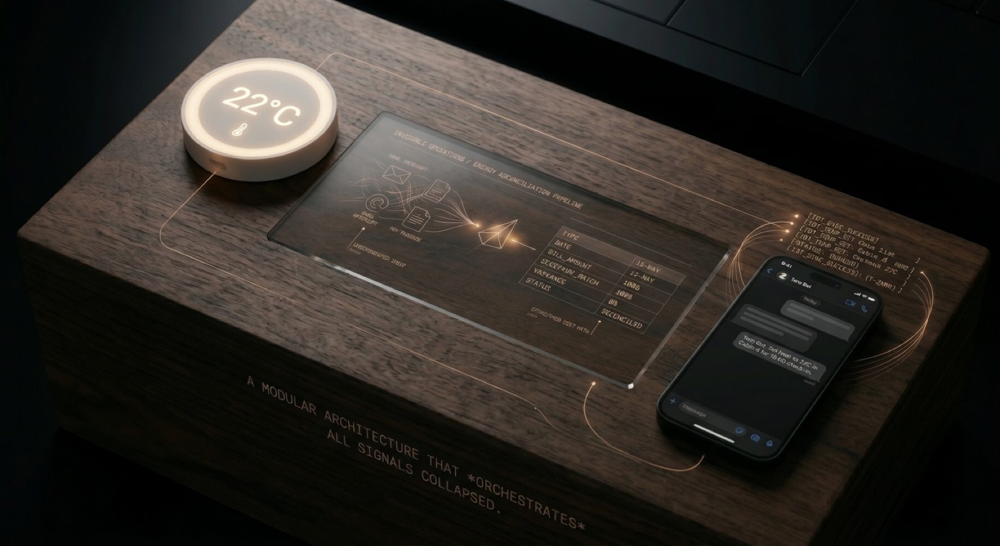

# tero.bot

  

A modular, AI-leveraged property management system built to eliminate operational friction across a vacation rental complex with four houses. Zero bloatware, zero generic SaaS — every signal collapsed into one operating surface.

## The Philosophy

Most property-management software is bloatware: rigid SaaS dashboards built for generic use cases, billed per seat, with feature lists nobody asked for and integrations nobody can extend. tero.bot takes the opposite bet — a high-efficiency modular architecture where each capability (locks, sensors, energy, comms, reservations) is its own thin layer, composable and replaceable. It connects the physical world (thermostats, smart locks, utility meters) with the digital operations that actually run the business (tasks, alerts, reports, guest comms). One operator, one codebase, no friction — a real-world expression of the [Pod-of-One](https://x.com/gokulr/status/2051683243934826773) philosophy.

### Modular Architecture Principles

- **One capability per module.** Each domain (`tuya`, `whatsapp`, `bills`, `sensors`, `energy`, `tasks`, `airbnb`, `telegram`, `inbound`) lives in its own folder under `src/lib/`, with a narrow public surface and no cross-domain reach-through.
- **Composable, replaceable layers.** Provider integrations (Tuya, Kapso, Postmark, Supabase) sit behind thin wrappers so any vendor can be swapped without touching business logic.
- **Physical ↔ digital bridge.** Hardware signals (temperature, energy, locks) flow through the same task/alert pipeline as software events — one operating surface, not two.
- **No generic abstractions.** The codebase models *this* operation (four houses, one operator), not a hypothetical multi-tenant SaaS. Features are added when needed, not speculatively.
- **Agent-friendly by design.** Module boundaries, conventions, and `CLAUDE.md` / `AGENTS.md` files exist so an LLM coding agent can navigate, extend, and ship changes with minimal human context.

## Core Modules

1. **Automated Hospitality** — IoT integration for live temperature and humidity control. Pre-checkin conditioning fires HVAC scenes 2h before a guest arrives so the property is at target temp on arrival. Threshold alarms surface when ambient conditions drift.
2. **Invisible Operations** — Backend data parsing that intercepts forwarded utility bills (emails) to track energy costs per property. Provider invoices land via inbound email, get parsed automatically, and attach to the right property. No spreadsheets, no manual entry.
3. **Zero-Friction Team UI** — A WhatsApp bot integration for issue report, task assignment, status tracking, and sensor querying. Cleaning and maintenance staff never download an app — they message a bot. Photos auto-create tasks. Admins query consumption and ambient readings in plain text. Pre-checkin conditioning confirms via inline buttons.

## Tech Stack

- **Frontend / Framework** — Next.js 16 (App Router) + React 19 + TypeScript + Tailwind v4 + shadcn/ui
- **Backend / Database** — Supabase (Postgres + Auth + Storage + Row Level Security)
- **AI / LLM Integration** — Claude Code as build agent; codebase architected and maintained through an agentic dev workflow with Linear MCP for ticket-driven iteration
- **WhatsApp API wrapper** — Kapso (BSP layer over Meta WhatsApp Cloud API)
- **IoT Hardware / Sensors** — Tuya Cloud (smart locks with offline + online passcodes, energy meters, temperature & humidity sensors)
- **Inbound Email Parsing** — Postmark Inbound (utility bill + Airbnb reservation emails)
- **Ops / Bot Surfaces** — Telegram (operator-side `/claude` queue) + WhatsApp (staff and guest comms)
- **Hosting / Deployment** — Vercel (Next.js runtime + Cron jobs)

## Source-Available (Build in Public)

I deeply believe in context engineering and learning in public. tero.bot is the actual operational engine running my properties. I am opening the source code for transparency, to share my system design logic, and to accelerate collective learning.

However, please note: this is a personal production tool, not a community-maintained open-source project. It is provided "as is" for educational and portfolio purposes. I do not provide third-party support, and I am not actively reviewing or accepting Pull Requests. Feel free to explore the code, fork it, and use the concepts to build your own systems!

**License & scope.** The code is published under the [MIT License](./LICENSE) — use, fork, and adapt freely. The "source-available" framing above is a social contract about expectations (no support, no PR queue), not a restriction on what you can do with the code. Secrets, env vars, and provider credentials are obviously not included — only the operational logic.
